# Group3-supplementary

# Final Project – National Investigation Unit,
# Scenario 3 – Suspect flees the scene.

### Daryl Bishop, Ryan Donaghue, Danny Martin, Samuel Knapp, Katie Barrett & Lily Finnegan-Hutchinson.

Presentation slides:

* * * * *

### Contents 

    • Project Brief
        ◦ Background
        ◦ Scenario 3 – Suspect flees the scene
    • Project Management/Version Control
        ◦ Risk Assessment:
        ◦ Jira/Git:
        ◦ Data Structure Planning:
    • Backend
    • Frontend
    • Security
    • Testing
    • DevOps
    • Application User Guide
    • Stretch Goals
    • Acknowledgements

* * * * *

### Project Brief

In your team of 5-6 people implement a minimum of one of the three scenarios presented. 
As well as the implementation, your team will be responsible for:

    • Generating a backlog from the brief.
    • Liaising with your appointed product owner, to validate any assumptions and answer any questions.

The implementation of the scenarios will encompass all of the technologies learned during the training to date, both programming and DevOps, and may require some additional self guided learning. 

The technologies we used in this project:

    • Project Management: Jira Scrum board
    • Version Control: Git
    • CI Server: Jenkins
    • Cloud Server: AWS EC2
    • Database Server: AWS RDS
    • Containerisation: Docker Swarm
    • Reverse Proxy: NGINX

### Scenario 3 – Suspect flees the scene

### Background

Sophie, your customer, works at the National Investigation Unit and has been building a relationship with a third-party provider (pseudonym REDSHIFT). Redshift specialises in gathering call records, financial transactions, and Automatic Number Plate Recognition (ANPR) sightings.

### Scenario 3 – Suspect flees the scene

An officer has spotted a suspect fleeing the scene of an incident in a car. They have reported back with the car’s number plate. The investigators now need to search with the car registration to work out:

    • Who the suspect was?
    • Where else have they been?

* * * * *

### Project Management/Version Control

### Risk Assessment

As part of our initial design phase we generated a risk assessment to analyse the potential risks to our project and determine control measures that we could implement to mitigate these factors. Our finding influenced our applications design and structure, and assisted us in prioritising our issues and epics within our Jira board.

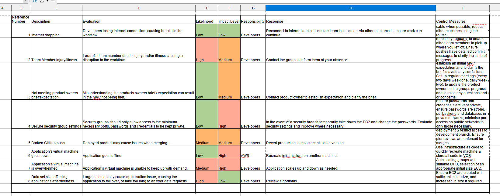

To ensure we continued to use the risk assessment throughout the project, we created an incident report which we filled out daily. By reanalysing the risks on a daily basis we were better able to make quick adjustments to our working style and reduce any adverse impact on our final product. For example, when a medical incident left us a team member down, to minimise the disruption to the workflow, we ensured the work was redistributed and that regular Git pushes with smart commits were made, making it easier for any returning team member to understand the projects progress and integrate into the current workflow state.  

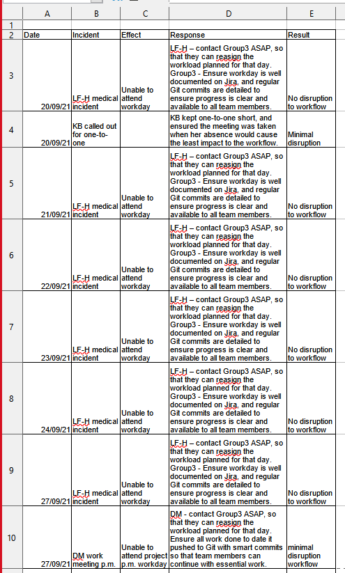

To further utilise our risk assessment, we placed it into a risk matrix on Jira. This enabled us to better visualise the risk prioritisation and where our measure controls needed to be more stringent. 

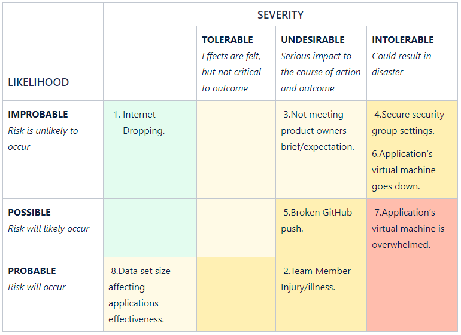

### Jira/Git

As part of the design phase we created a shared Jira board modelled as a Scrum board, and populated it with the following epics:

    • DevOps
    • Map/Location Data
    • Documentation
    • Information Cards/Profiles
    • Database
    • Testing
    • Users
 
Which we then populated with their related issues and child issues. 

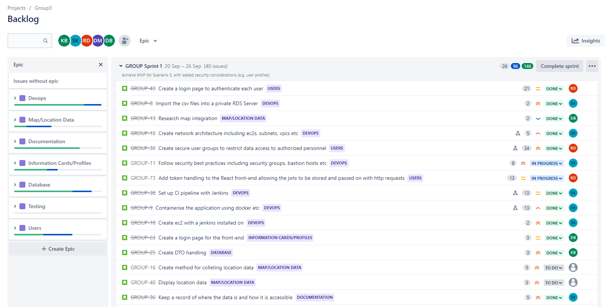

By prioritising our epics and assigning story points to our issues (which was influenced by our risk assessment and risk matrix), we were better able to manage our time. Likewise linking child issues made us aware of the order the work needed to be completed in, in order to cause the least disruption to the application workflow.

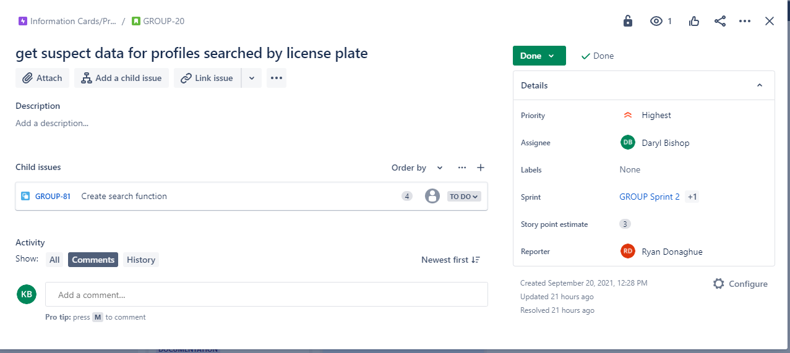

We created six GitHub repositories (Group3-supplementary, Group3-Terraform, Group3-Backend, Group3-Frontend, Group3-NGINX, Group3-Selenium) the latter four of which we connected to our Jira board through a webhook. This enabled us to make smart commits throughout the project, ensuring each team member’s progress was clear to the wider group. The wehook also enabled us to automate and perform rolling updates triggered by pushes to main branch. 

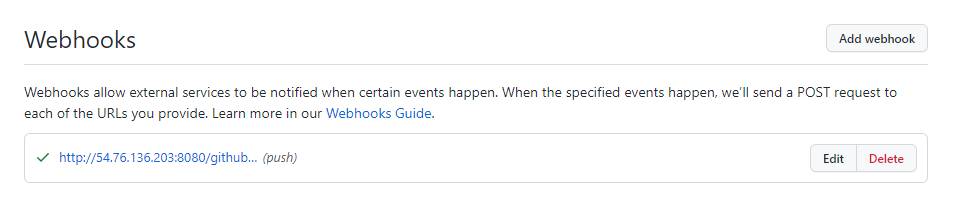

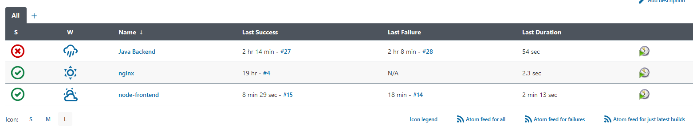

The regular smart commits also enabled us to identify what adjustments or additions were made with each Git push. Which would be vital when managing branches and identifying the differences between versions of the project.

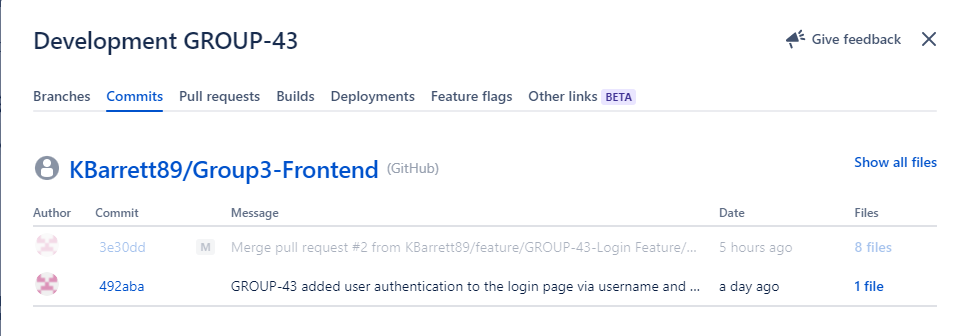

We used a feature branch model, with a branch naming convention linked to our Jira board’s epic and issue identifiers (numbers and name). This enabled us to divide our group into smaller teams to work simultaneously on different areas of the project, e.g. backend, frontend and DevOps. Utilising the feature branch model also supported our security measures, as development was made on feature branches, protecting the main branch source code base. 

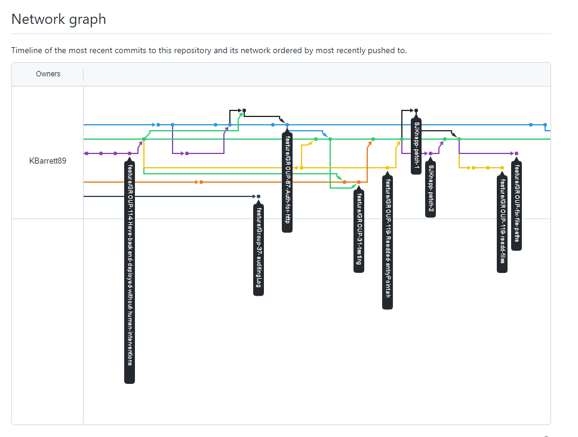

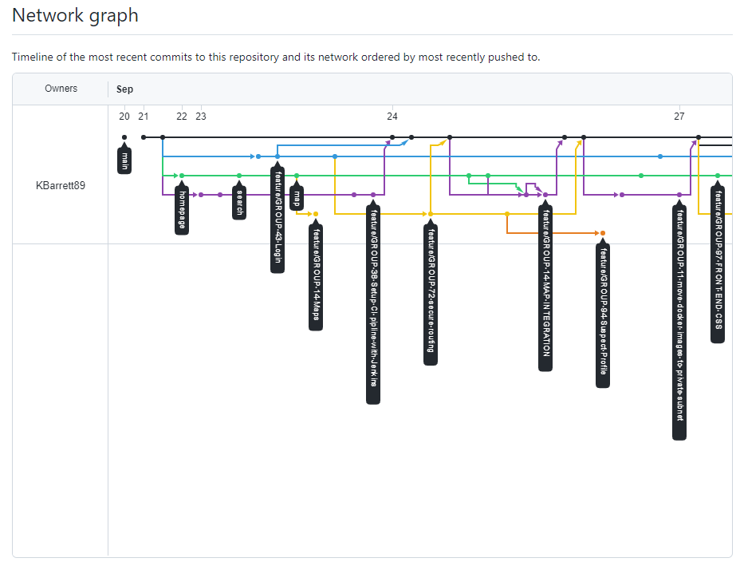

By implementing branch protection rules on our repositories, which enforced two peer reviews on all push request made, ensured all code was correct before approval.

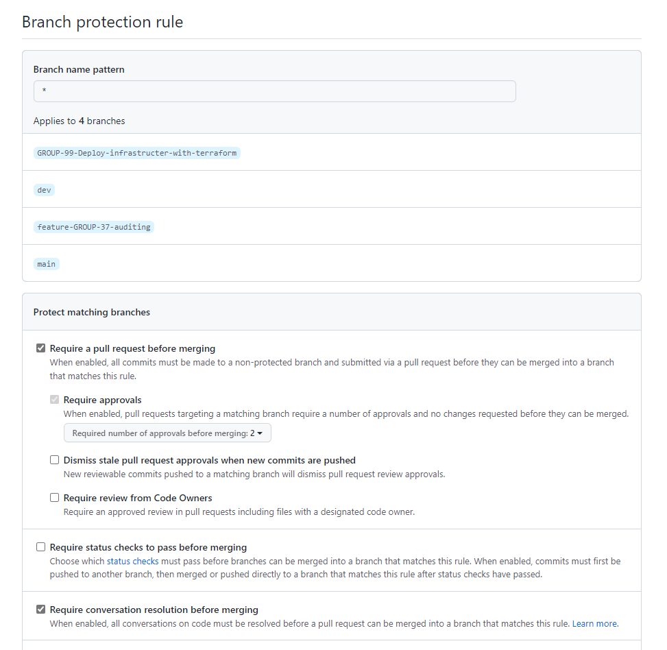

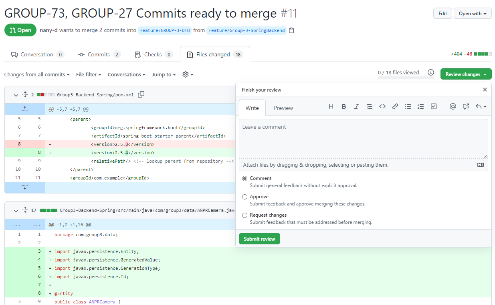

We split our project into two sprints, with the focus on the first sprint being to produce an minimun viable product (MVP) with strong security, and the second sprint to develop our project into a more refined application. 

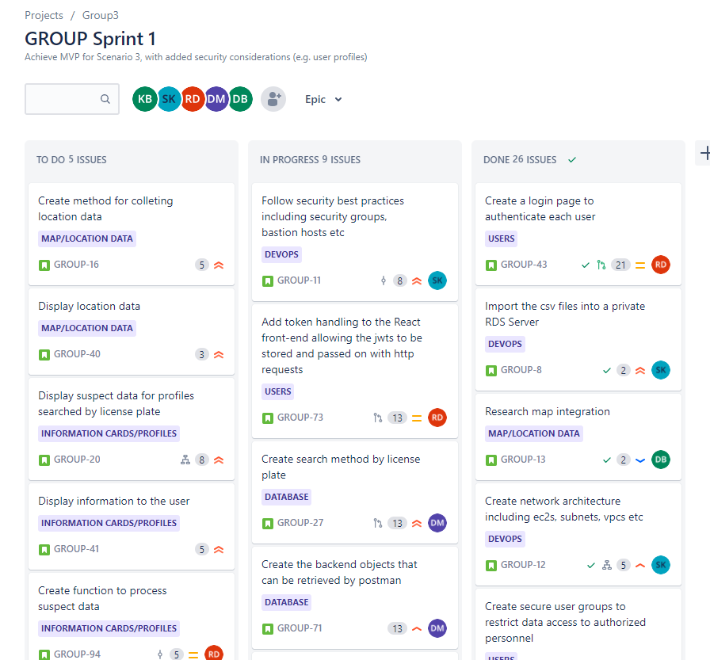

We used Jira's built in reports to assess our efficiency and sprint allocations. Our burn-down chart at the beginning of the sprint followed the guideline reasonably well. However as the project progressed (and we created additional issues and child issues) we found that we deviated from the guideline more with each day. We determined more practise within the industry would better enable us to allocate more realistic story points, and populate the Jira board with the majority of the issues at the beginning of the project, factors which we identified as the main cause of the deviations from the guideline. We were more familiar with the project by the second sprint, and were therefore able to populate our Jira board with the majority of the issues before initiating the sprint. As a result we deviated less from the guideline, than we had in the first week.

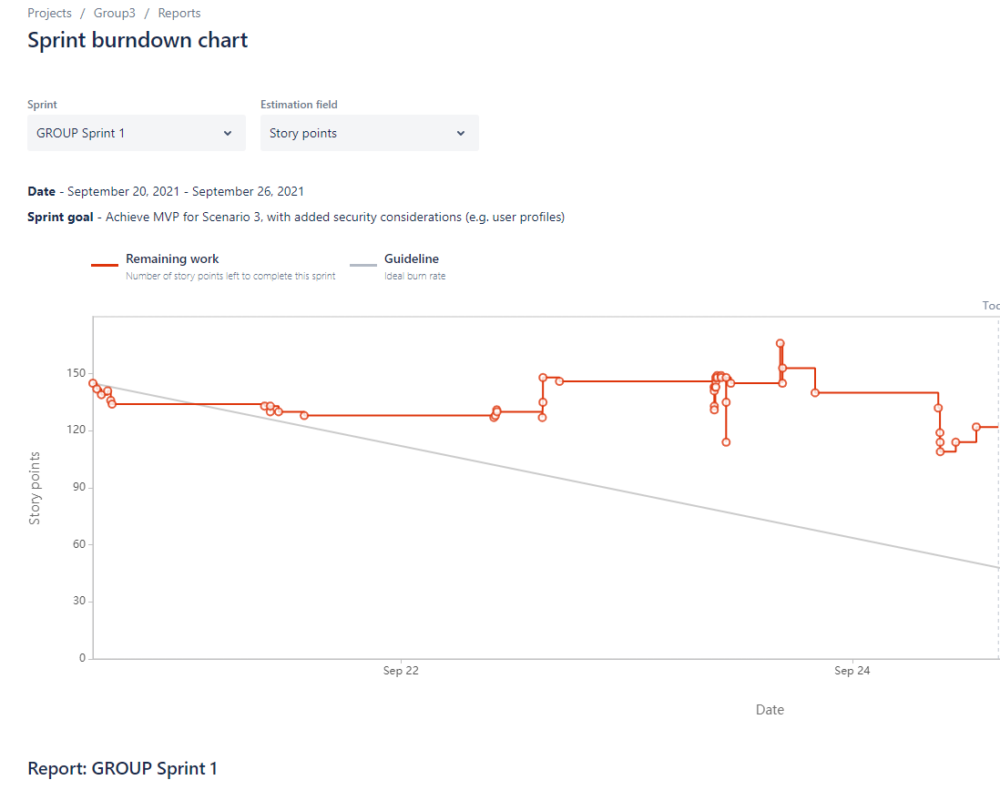

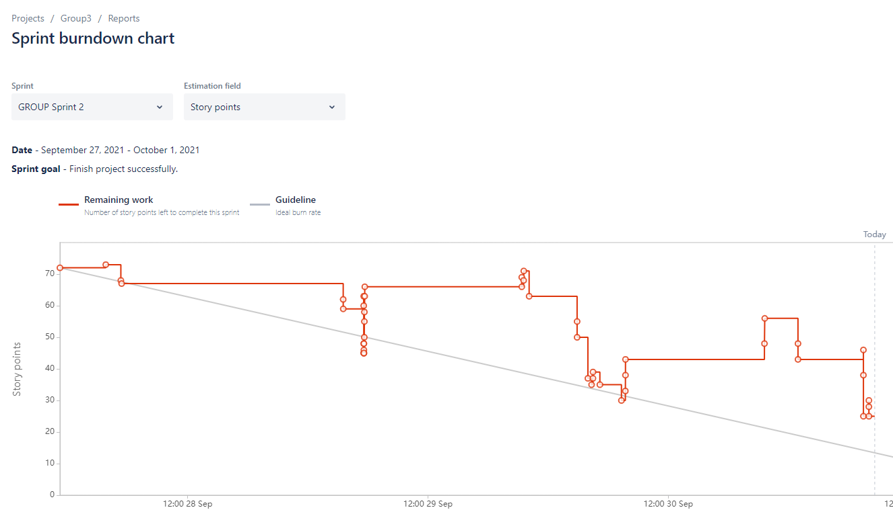

* * * * *

### Data Structure Planning

Another part of our initial design phase was to determine which data we needed from the tables we were provided with, to meet the application MVP. To ensure all team members knew what data we would be using, we created a diagram to highlight the tables, the specific data fields, and any foreign keys that we had chosen to use. The diagram also identified the relationship between the graphs (many-to-many, one-to-many, etc).

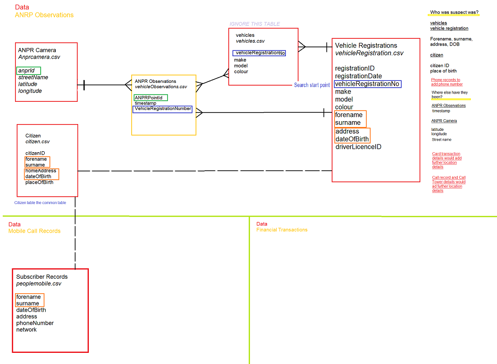

Similarly a table was produced to outline all the tables and data field names and their types, for example, Table name: vehicle_registration, data field name: Forenames, type: VARCHAR(50).

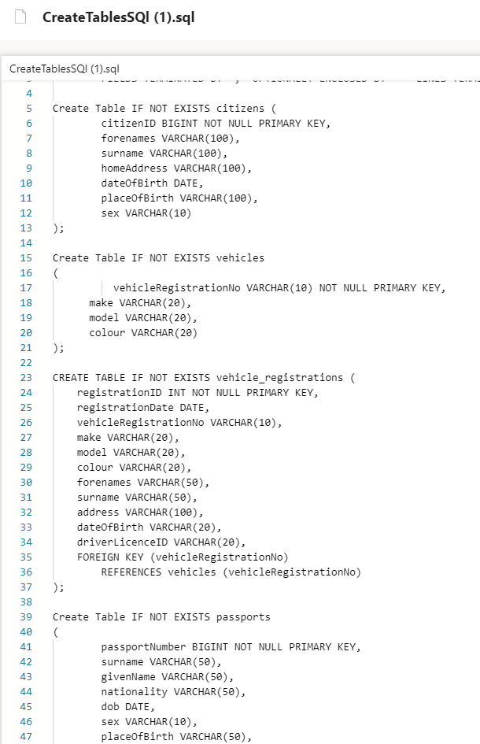

Both documents were created to standardise data usage, naming and type conventions, in an attempt to minimise merge conflicts.

* * * * *

### Backend

The Backend is run in Java with a Spring Boot framework.  It was built using Maven. It responds to the http request made to it with a vehicle registration plate with an InfoDTO that contains the JSON object required to display all the data for frontend.

The request initially lands in the controller class which contains a getmapping. From there it is passed through a service class that sends for data in all of the relevant repos required to build the JSON object. This class then constructs this object which consists of 3 parts: 

    • A person object with data taken from the citizen and phone number database.
    • A list of vehicle registration sightings, with timestamps and locations, taken from the ANPR camera and ANPR observations databases. 
    • And, a vehicle object with data taken from the vehicle registrations
      taken from the database.  

The java classes that map onto these databases are connected via a relational database setup using spring annotations.

Auditing
A simple auditing strategy has been implemented to record the numberplate searches that have been done. The auditing is done using a logger, that appends to a separate table in the database, the numberplate searched for.

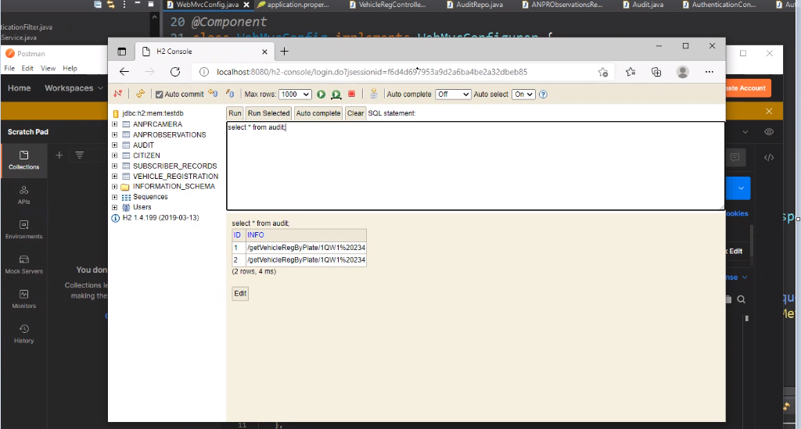

* * * * *

### Frontend

* * * * *

### Security

Project set up with Spring Security in the Backend.

Security creates custom endpoint for authentication, connects to a user table in the RDS database and verifies http requests via jwt. The authenticate endpoint is available without a jwt but requires a username and password, all other http requests require a valid jwt for authentication and registering a new user requires a valid jwt token and admin permissions.

Frontend refuses access to app unless valid login is put in, redirecting all traffic to the login page. Logging in generates a jwt token which is passed into all http requests from the front-end to the backend, authenticating them. The frontend checks if the jwt token is expired on every Route change and redirects the user to the Login page when the jwt token has expired. Clicking the logout button clears the user’s session and returns them to the login page and redirects all traffic once again until the user has re-authenticated.

* * * * *

### Testing

Unit tests using JUnit are ran on all the functions in the services class of the backend to check the database (H2 console) is returning the correct values. 

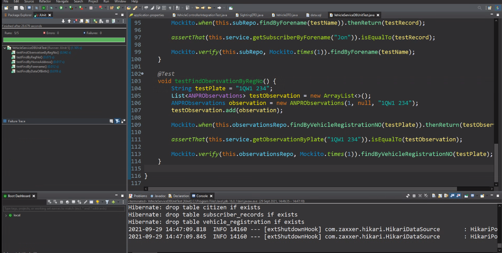

An Integration test is ran on the get request to ensure that the correct infoDTO is returned by the search.

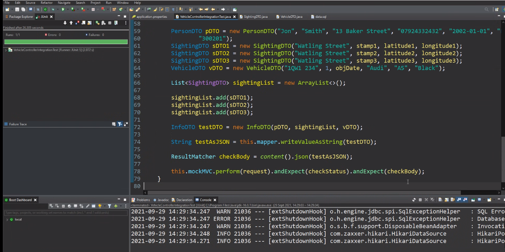

For our manual testing we used a H2 console as a stand in for an RDS, whilst creating the backend. We also used Postman to send Get requests, whilst the frontend was being developed.

* * * * *

### Devops

* * * * *

### Stretch Goals

    • Expansion of the suspect profile to include financial and mobile data:
        ◦ Subscriber Records – Network
        ◦ Bank Cards – Bank

    • Expansion of the suspect location records to include: 
        ◦ Call and cell tower record
        ◦ EPOS and ATM transactions

Further location records such as this would be vital evidence when determining the exact driver of a car when is has multiple registered users.
      
    • Create a search function in the suspect location map and table.

    • Expand auditing function to also record the user and a time and date stamp.

* * * * *

### Acknowledgements
We would like to sincerely thank all of our amazing QA trainers, with a particular thanks to Jordan Harrison and Pierce Barber for all the help they provided us whilst creating this project. 
